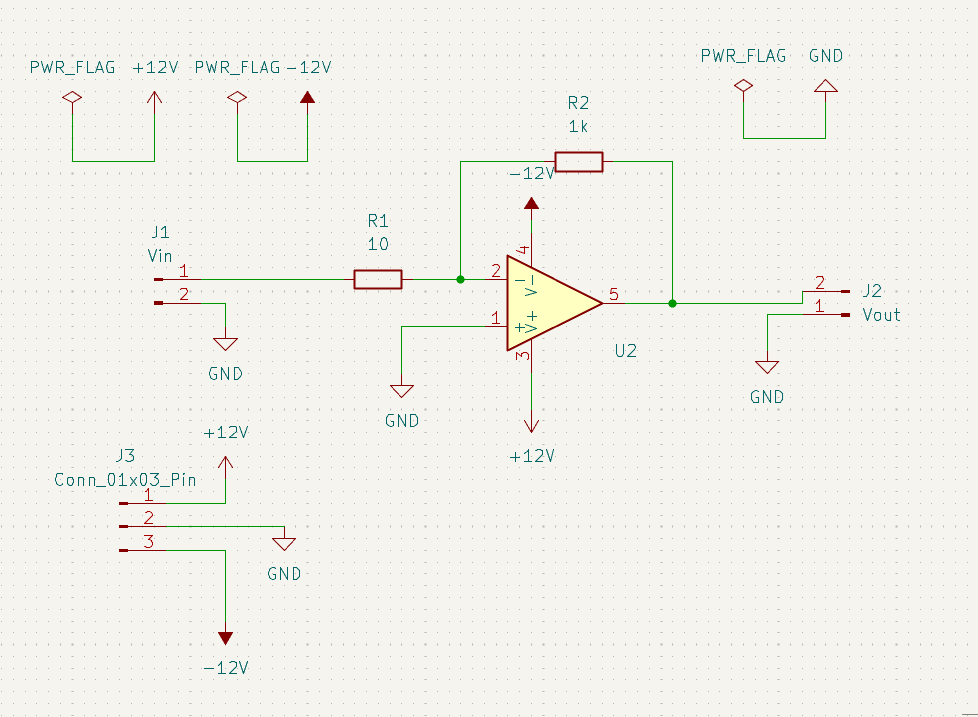
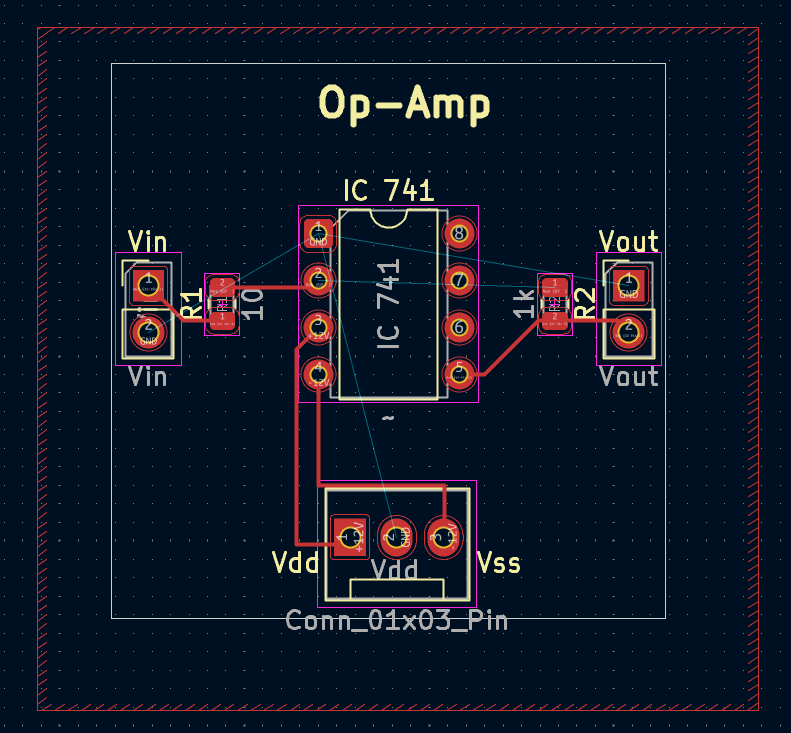
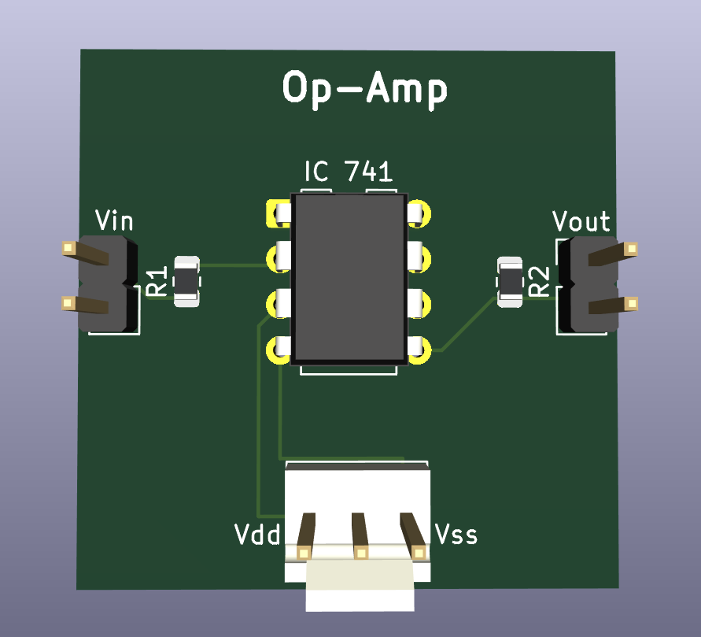

# Daily Report — 27-05-2025

## Tasks Completed
- **Task 1:** Learned about Obsidian and created a basic daily report format to track completed tasks.
- **Task 2:** Learned the basics of GitHub. Created a new repository and uploaded a markdown file listing all completed daily tasks and goals for the next day.

## Plan for Tomorrow
- **Task 1:** Read the *Printed Circuit Boards Design* book.
- **Task 2:** Study the basics of Raspberry Pi and learn how to interface analog sensors with it.
- **Task 3:** Try to optimize the Op-Amp design and learn techniques for efficient PCB routing.

---

# Daily Report — 28-05-2025

## Tasks Completed
- **Task 1:** Optimized the Op-Amp design in KiCad.
- **Task 2:** Completed the first half of Chapter 1 from the *Printed Circuit Boards Design* book.
- **Task 3:** Watched tutorials on how to interface analog sensors with a Raspberry Pi.

## KiCad Design

#### Schematic View  

#### PCB Layout  

#### 3D PCB View  

## Plan for Tomorrow
- **Task 1:** Learn more about GitHub commands. 
- **Task 2:** Complete the 1st chapter of the book.

---

# Daily Report — 29-05-2025

## Tasks Completed
- **Task 1:** Learned how to connect VS Code with GitHub and commit changes directly from VS Code.
- **Task 2:** Read more about the PCB design flow and understood the general steps involved.
